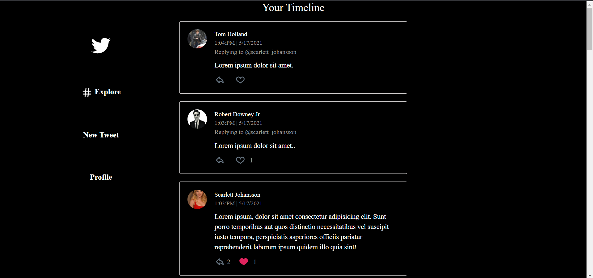
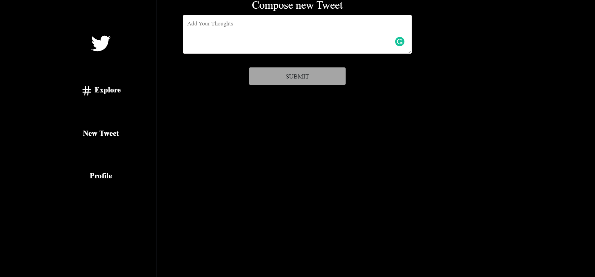
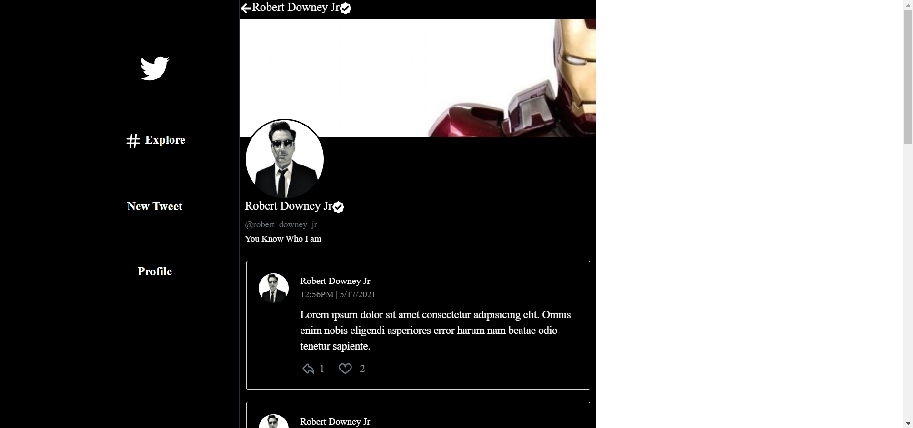

Live demo => [https://twitter-nikhil.netlify.app/](https://twitter-nikhil.netlify.app/)

## Instructions to Run the App
Install the Required packages by running

### `npm install`
In the project directory, you can run:

### `npm start`

Runs the app in the development mode.\
Open [http://localhost:3000](http://localhost:3000) to view it in the browser.

